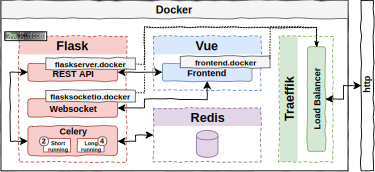
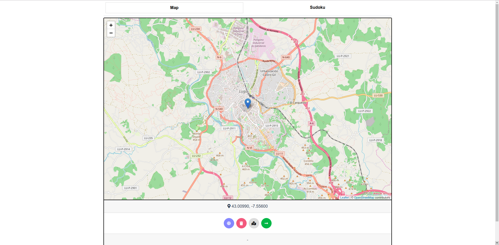
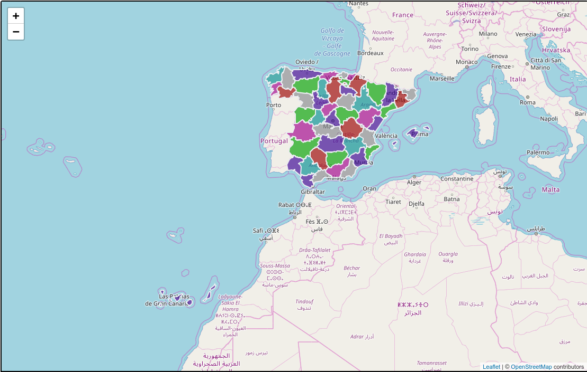
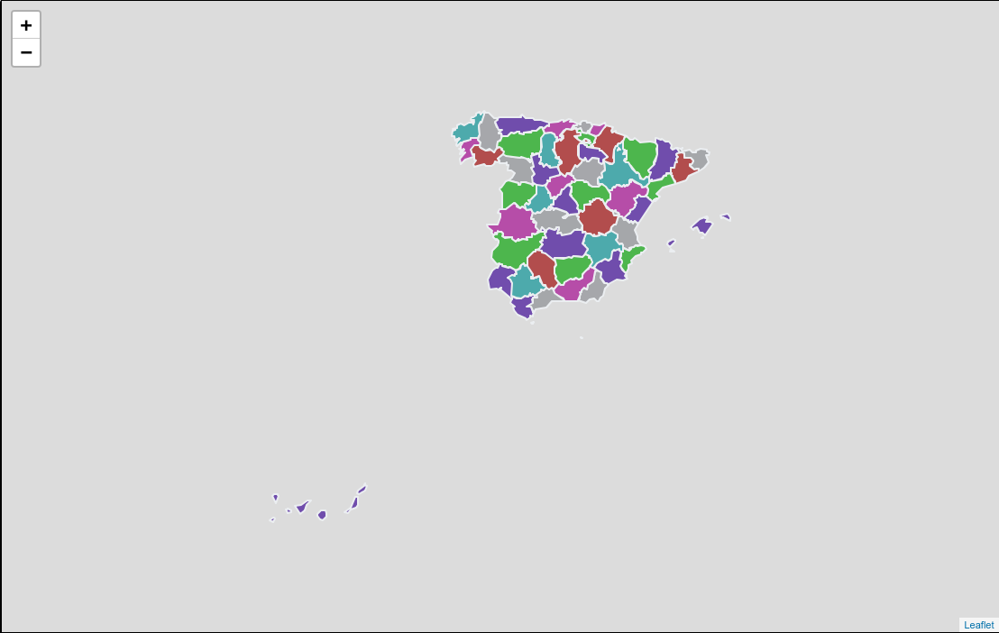
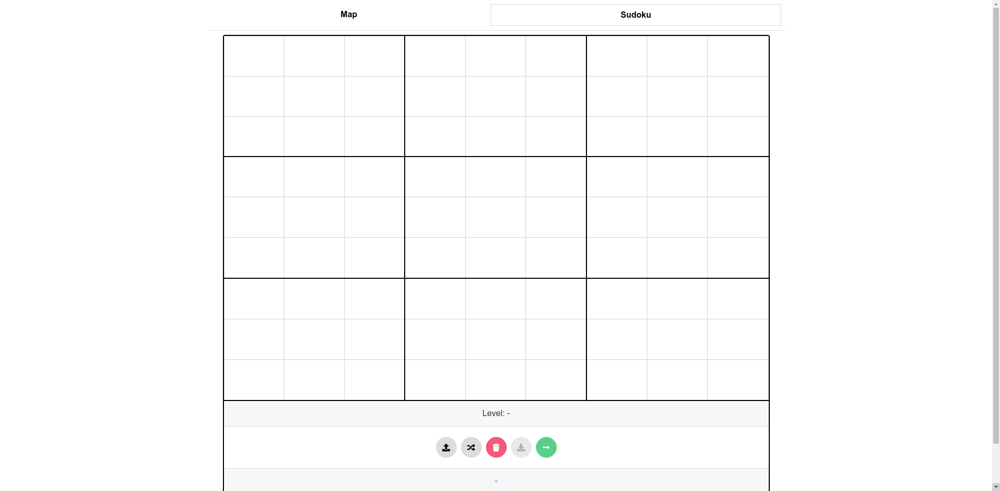
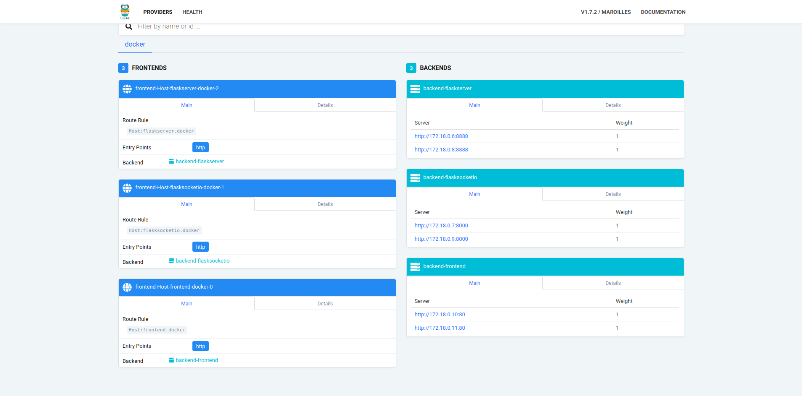

# vue-flask-celery-docker-leaflet
Dockerized client-server application of Constraint Satisfaction Problems using Flask, Websockets, Celery, Vue and Leaflet.

# Stack
- **Vagrant & Ansible** for cloud deployment (on a VirtualBox machine).
- **Flask** to build the REST API (with GEvent to allow async requests).
  - **Gunicorn** to serve REST API with GEvent workers.
- **Celery** to delegate the execution of heavy tasks, with redis backend.
  - **MapTaskQueue** will route csp solver for map tasks. They are expected to be long-running tasks due to reverse geocoding.
  - **SudokuTaskQueue** will route csp solver for sudoku tasks. They are expected to be short-running tasks.
- **Flask-SocketIO** to notify the client ASAP of the solution with no polling (with GEvent to allow async requests).
  - **Gunicorn** to serve Websockets with GEventWebsocket workers respectively.
- **Vue** to build the frontend (with Vue-Router, Vuex, Vue-socketio, axios, vue2leaflet, etc).
- **Docker** to deploy each service on the private cloud.
- **Traeffik** as load balancer of dockerized services.

# Architecture

<p align="center">
  
</p>

The image shows the proposed architecture. The architecture expose several public endopoints:
- `flaskserver.docker` &rarr; This is the main entry point to the REST API.
- `frontend.docker` &rarr; This is the main entry point to the Frontend Web.
- `flasksocketio.docker` &rarr; This is the main entry point to the websocket subsystem.
- `192.168.33.20:8080` &rarr; This is the entry point to the Traeffik Dashboard, where you can see which services have been deployed.

Besides these endpoints, there are other private endpoints that are not accessible from outside the docker's internal network, like redis or celery.

# Installation
Before installing it, it is required to have installed vagrant and ansible:
- `Vagrant >= 2.0.1`
- `Ansible >= 2.6.2`

Once installed, clone this repository and go to the deploy directory and type the following command on a terminal:
```bash
/deploy$ vagrant up
```
Wait a few minutes and that's it! You'll have the whole application deployed and ready to use!

# Configuration and Usage
Endpoints exposed by traeffik require a domain name, so the IP address of the machine will not be valid. To do this, edit the `/etc/hosts` file and add the following line:
```bash
192.168.33.20 flaskserver.docker frontend.docker flasksocketio.docker
```
**The default configuration is the recommended one to deploy the application**. However, it is possible to modify certain parameters on both sides.

### Backend configuration
In [flask_inits.py](csp_solver_cloud/src/server/flask_inits.py#L33-L34), you can choose two parameters:
- **BOOST**: spawn a new green thread in every request. Enables the endpoint to accept more requests per second.
- **GEOCODER**: choose the reverse geocoding engine. Options are shown in comments.
- The rest of the parameters are recommended as they are.
In [config.py](csp_solver_cloud/src/server/config.py), it is recommended to modify just the following keys in ProductionConfig:
- **CELERY_TASK_RESULT_EXPIRES**: choose the time (in seconds, or a timedelta object) for when after stored task tombstones will be deleted.
### Frontend configuration
In [config.json](csp-frontend/static/config.json), you can change the url for dockerized services. If you change one of these url, you **must** update accordingly the **traeffik frontend rules** in [docker-compose.yml](deploy/ansible/csp/files/docker-compose.yml) file and hosts in `/etc/hosts`.

### Usage - MapView (default view)
Once you have configured hosts, open Firefox or Chrome/Chromium browser and type on a tab/window: http://frontend.docker. If all went well, you should see the following image:

<p align="center">
  
</p>

When the site loads, it will try to geoposition your IP on the map. After that, you can click with the mouse on any country around the world to solve the constraint satisfaction problem. If all went well, guessing that you has clicked in Spain, you will see something similar to the following image:

<p align="center">
  
</p>

When you has a `GeoJSON` layer on the map (i.e. one solution), you can hide the tilemap in order to see only the solution:

<p align="center">
  
</p>

### Usage - SudokuView
If you type on a tab/window: http://frontend.docker/#/sudoku, you should see the following image:

<p align="center">
  
</p>

When this view loads, you can fill the grid manually, randomly (choosing a difficulty level) or via a string. For example, if we upload the following sudoku: `590000060070060501000000000000018024908004600000600018040309080350100246080200000` and solve it, we well see the following image:

<p align="center">
  
</p>

## Scaling services
One of the advantages of deploying the services in docker, is the ease with which we can scale them. To do this, enter the following commands on a terminal: 

```bash
/deploy$ vagrant ssh # enter to virtual machine (this command is executed on the host machine)
ubuntu@numbersDeploy:~$  cd /opt
ubuntu@numbersDeploy:~$ sudo docker-compose up -d --scale flaskserver=2 --scale frontend=2 --scale socketio=2 # we are scaling the api rest server 2 times, nginx server (frontend) 2 times, and socketio server 2 times in a round-robin fashion.
```
If you go to `192.168.33.20:8080` and see the Traeffik Dashboard, you will see in the backends part, the 6 new services!

<p align="center">
  
</p>

However, due to the virtual machine resource constraints, it can be exhausted. For this reason, it is recommended to be careful when scaling services.

# Final Notes
In order to support map tasks, this application uses the following external services:
- In the backend side, a reverse geocoding system with Photon (limited service) and/or ArcGIS (full service) is used. In the first case, its terms of use indicate that *"You can use the API for your project, but please **be fair** - extensive usage will be throttled. We do not guarantee for the availability and usage might be subject of change in the future."*, whereas in the second one, *"(...) If you merely view the results of these operations on a map and discard them immediately afterward, you can use these operations free of charge. However, if you store the results, in a database for instance, these operations require a subscription"*. 
- On the other hand, in the frontend side, a free geolocation service is used (ip-api).

**Therefore, please, respect their conditions and terms of use.**

## Acknowledgement
Geospatial data has been downloaded from [Naturalearthdata](https://www.naturalearthdata.com/http//www.naturalearthdata.com/download/10m/cultural/ne_10m_admin_1_states_provinces.zip).

